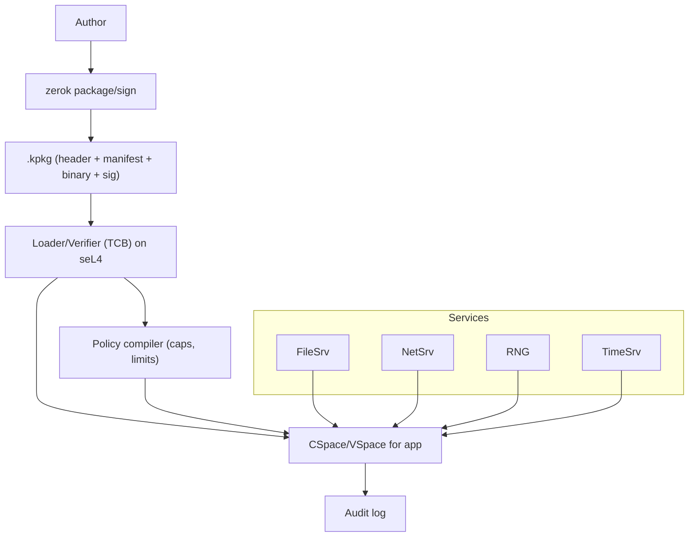

# Threat Model

Version: 1.0
Context: zerok produces and runs .kpkg packages with embedded manifests that are signed, then enforced on an seL4-based runtime using a capability model. Goals: provenance, least privilege, deterministic & reproducible execution, and high-signal auditability.

## Scope and System Overview

zerok covers the path from package creation → verification → policy compilation → process spawn → audit.



## Security Objectives
1. Provenance & integrity: Only signed, non-tampered packages run.
2. Least privilege: A process has only the capabilities declared in its manifest.
3. Determinism & reproducibility: Given the same inputs/policy, runs are repeatable.
4. Containment: Exploits in the binary cannot escape the granted capability set.
5. Confidentiality of keys/material: Private keys and secrets are protected in build & deploy.
6. Auditable behavior: Denials/faults/resource use are recorded and verifiable.
7. Update safety: Rollback and unsigned updates are blocked (when enabled).
8. Reduced attack surface: zerok aims to provide sandboxing/isolation without using containers

## Trust assumptions
- seL4 is correctly configured and its formal guarantees hold (kernel non-bypassable isolation).
- Loader/Verifier is part of the TCB and is trustworthy.
- Signing keys are generated/stored securely (prefer HSM).
- Service processes (FileSrv/NetSrv/TimeSrv/RNG) are minimal, reviewed, and within the TCB perimeter you accept.
- The host hardware behaves within expected bounds (micro-architectural channels mitigated but not eliminated).

# Attack Surface
- File format & parsing: header offsets/sizes, manifest parser, signature block.
- Verification binding: what exactly is signed (must be entire file), anti-rollback.
- DNS/TLS decisions: hostname checks, pins, IP resolution timing.
- Filesystem access: path canonicalization, symlink/hardlink races, namespace breakout.
- Dynamic loading/exec: dlopen/plugins/child processes, RPATH/RUNPATH/env.
- Resource controls: memory mapping (mmap/shmem), CPU quotas, timers.
- Service endpoints: NetSrv misuse (raw/UDP), FileSrv namespace, TimeSrv precision, RNG quality.
- Audit/log integrity: tamper resistance, completeness, time source.
- Key management: generation, storage, rotation, revocation.

## Threats and Mitigations (STRIDE by component)

| Component                | Threat                | Example                                                  | Primary Mitigations                                                                                                              |
| ------------------------ | --------------------- | -------------------------------------------------------- | -------------------------------------------------------------------------------------------------------------------------------- |
| **.kpkg file & parser**  | **Tampering**         | Extra bytes appended after a signed region               | Sign & verify the **entire file** (header+manifest+binary); reject trailing data; strict size/offset checks; one canonical EOF.  |
|                          | **DoS/Crash**         | Overflow via `manifest_size=0xFFFF_FFFF`                 | Bounds-check all fields; cross-field invariants (no overlaps); max sizes; fail-closed.                                           |
| **Verification**         | **Rollback**          | Old but validly signed package accepted                  | Store and enforce monotonically increasing `version`/`epoch`; maintain revocation list; optional transparency log.               |
|                          | **Key spoofing**      | Wrong trust root used                                    | Pin org keys; support N-of-M signing; HSM-backed verification keys on device.                                                    |
| **Policy→caps**          | **Elevation**         | Manifest grants unintended power (e.g., `/etc` wildcard) | Lint manifests; CI “capability diff”; sensible defaults (deny-all; no wildcards); human review required on scope increase.       |
| **Filesystem**           | **Path escape**       | `/etc/config` → symlink to `/`                           | FileSrv: open via `openat2`-style with `RESOLVE_BENEATH`, `O_NOFOLLOW`; pre-canonicalize; immutable namespace.                   |
| **Network**              | **MITM / wrong peer** | TLS without hostname/SAN check                           | NetSrv enforces TLS+hostname verify; optional **SPKI pinning**; pre-resolve DNS and/or IP allowlists; deny plaintext by default. |
|                          | **UDP/Amplification** | Reflection via open UDP                                  | Deny UDP/raw sockets unless specified; rate-limit; token buckets; no broadcast/multicast unless declared.                        |
| **Runtime env**          | **DLL/RPATH hijack**  | Loads from writable dirs                                 | No ambient library search paths; static link or absolute paths; disallow `dlopen` unless explicitly allowed.                     |
| **Resources**            | **DoS**               | Unbounded RAM/CPU                                        | Hard **RSS/mapping** caps incl. `mmap`/shmem; fixed-rate scheduling & CPU quotas; per-pkg I/O limits.                            |
| **Side/covert channels** | **Info leak**         | Cache/timing between tenants                             | Cache coloring; core pinning; SMT off across trust domains; coarse timers; constant-time crypto; bandwidth/jitter shaping.       |
| **Audit**                | **Repudiation**       | “It didn’t happen”                                       | Append-only logs; signed log segments with chain-of-hash; include run IDs and monotonic counters; ship to remote collector.      |
| **Updates**              | **Insecure OTA**      | HTTP download, no sig check                              | Only accept `.kpkg` updates with valid org signatures; enforce anti-rollback; staged rollouts with attestation.                  |

## Secure Defaults (draft)
```toml
# Network
[capabilities.network]
plaintext = false
require_tls = true

[capabilities.network.connect."api.example.com:443"]
tls = { hostname_verify = true, spki_pins = ["sha256:BASE64PIN=="] }
udp = false

# Files
[capabilities.files]
no_shared_ro = true

[capabilities.files.read]
paths = ["/app/data/config.toml"]  # avoid wildcards

# Execution & loading
[capabilities.exec]
allow_spawn = false
allow_dlopen = false

# Resources
[capabilities.memory]
max_bytes = 128 << 20
rss_max   = 96  << 20

[capabilities.cpu]
schedule = "fixed"
quota_ms_per_s = 200
core = 2
jitter_ms = 2

# Time & RNG
[capabilities.time]
resolution_ms = 10
rdtsc = false

[capabilities.rng]
provider = "os_csprng"
```

## Residual Risks (explicitly not fully solved)
- Bugs inside the binary (memory-safety, logic) can still execute within granted capabilities.
- Over-broad manifests reintroduce traditional risk (principle of least privilege broken).
- Side/covert channels can be reduced, not eliminated.
- Physical attacks (UART/JTAG, chip-off, EM/power analysis) require separate controls.
- Compromise of TCB components (Loader/Verifier or service endpoints) undermines enforcement.
- Supply-chain of dependencies (vulnerable libraries) still needs patching/attestation.
